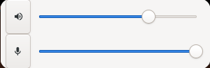

# volume

## Requirements

- `wpctl` must be installed.
- `.config/rancid/scripts/volume` must be executatble.

## Functionality

The volume widget gives the user the abiliy to adjust their volume levels.

## Styles

1. Popout

    - This style will create a button that when pressed pops out a window that shows input and output sliders with mute buttons for both.

    
